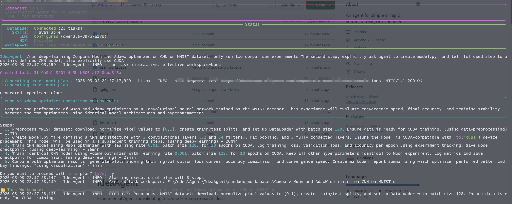

## **This is a very early edition，feel free to submit issues or contributions**
# IdeaAgent

Experimental Agent for validating machine learning research ideas.

## CLI



## Features

- Support for multiple research types: Deep Learning, Machine Learning, Agent
- AgentSkills-based skill system for extensible capabilities
- Real-time task status tracking and display
- Sandboxed execution using conda environments
- Loop detection to prevent infinite execution
- SQLlite for persistent storage
- MCP (Model Context Protocol) support
- CLI interface inspired by Claude Code

## Installation

```bash
# Clone or navigate to the project
cd IdeaAgent

# Create virtual environment
python -m venv .venv
.venv\Scripts\Activate.ps1  # Windows PowerShell

# Install dependencies
pip install -e .

# Or using uv
uv sync
```

## Configuration

1. Copy the example environment file:
```bash
copy .env.example .env
```

2. Edit `.env` and set your API keys and configurations.

## Usage

```bash
# Start the agent
IdeaAgent

# Validate a skill
IdeaAgent validate ./skills/your-skill

# List available skills
IdeaAgent skills

#Individualy set workspace
IdeaAgent: /workspace ./user_workspace

# Run with specific idea
IdeaAgent: /run  "deep-learning"  "Your research idea here" --workspace ./user_workspace

Example： /run machine-learning Compare Linear Regression and Logistic Regression
```

## Project Structure

```
IdeaAgent/
├── src/IdeaAgent/          # Main source code
│   ├── __init__.py
│   ├── cli.py            # CLI interface
│   ├── models.py         # Data models
│   ├── database.py       # MongoDB integration
│   ├── llm.py            # LLM calling module
│   ├── skills/           # AgentSkills integration
│   ├── sandbox.py        # Sandboxed execution
│   ├── mcp.py            # MCP support
│   ├── state.py          # Task state management
│   └── loop_detector.py  # Loop detection
├── skills/               # Skill definitions
│   └── example-skill/
│       ├── SKILL.md
│       ├── scripts/
│       └── references/
├── tests/                # Test files
├── .env                  # Environment variables (create from .env.example)
└── pyproject.toml
```

## Creating Skills

Skills follow the AgentSkills specification. See `skills/` directory for examples.

```bash
# Create a new skill directory
mkdir skills/my-skill

# Create SKILL.md with frontmatter
cat > skills/my-skill/SKILL.md << EOF
---
name: my-skill
description: What this skill does
---

# Skill Instructions

Detailed instructions here.
EOF

# Validate the skill
IdeaAgent validate ./skills/my-skill
```
## Star History

[](https://www.star-history.com/?repos=Haloflag11%2FIdeaAgent.git&type=date&legend=top-left)

## License

Apache License 2.0
