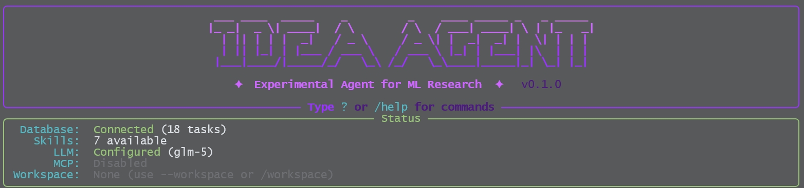
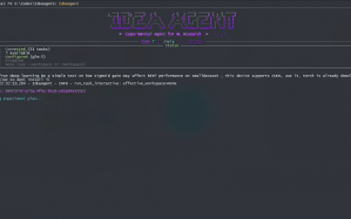
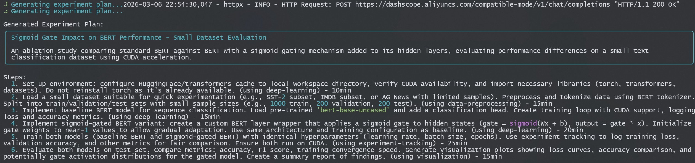
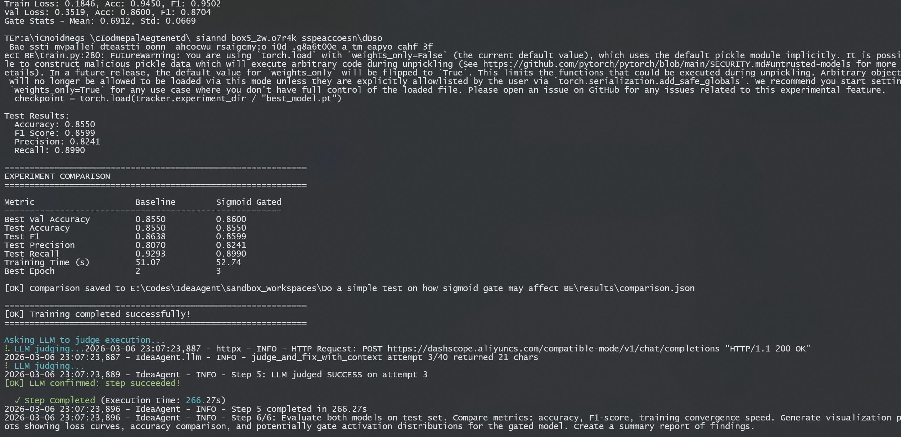
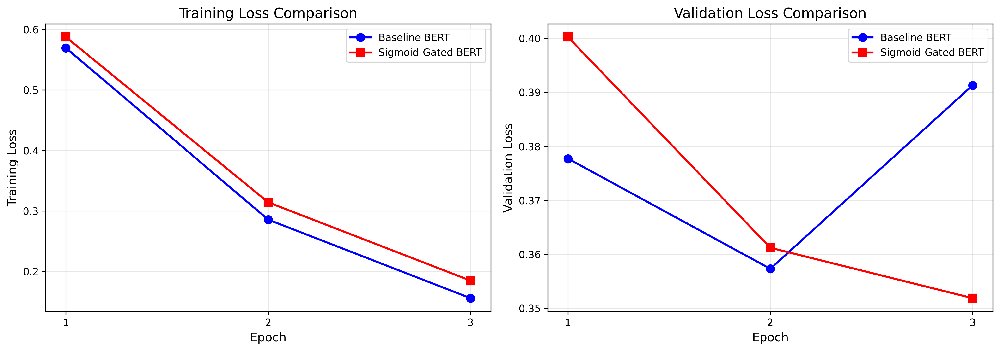
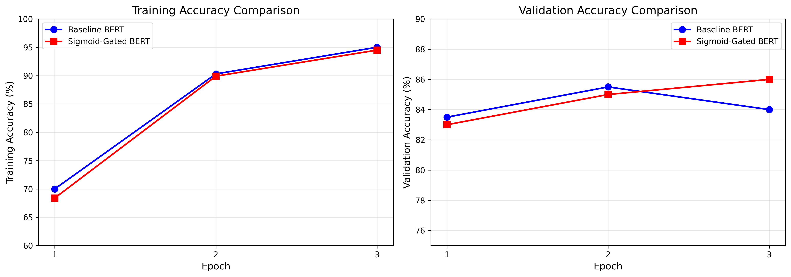
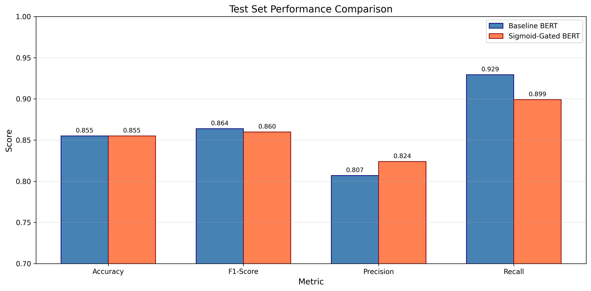
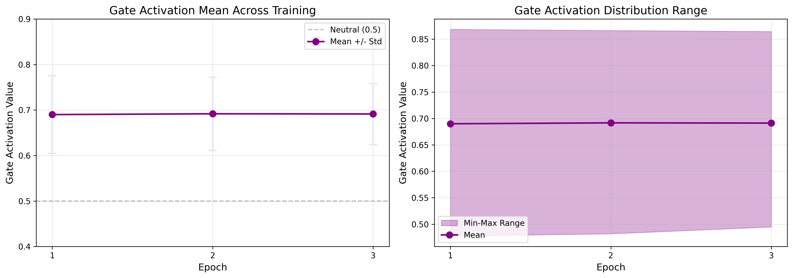
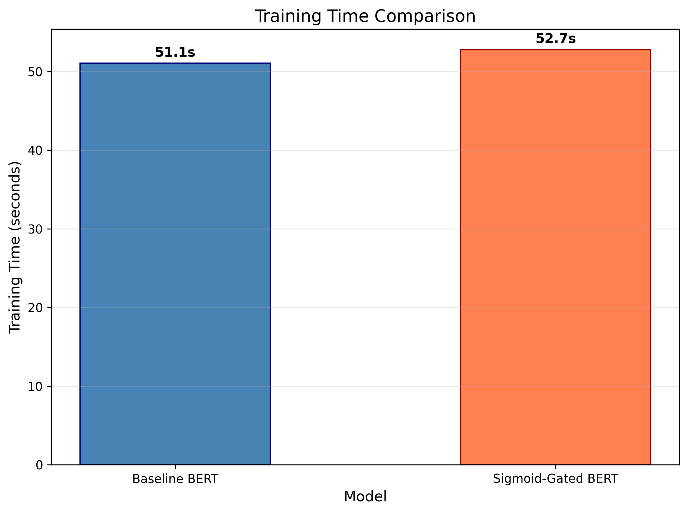

<div align="center">




<br/>
<br/>

     


<strong> This is a very early edition，feel free to submit issues or contributions
</div>

# IdeaAgent

Experimental Agent for validating machine learning research ideas.

Run your idea with a single command, and leave it to IdeaAgent



## Features

- Support for multiple research types: Deep Learning, Machine Learning, Agent
- AgentSkills-based skill system for extensible capabilities
- Real-time task status tracking and display
- Sandboxed execution using conda environments
- Loop detection to prevent infinite execution
- SQLlite for persistent storage
- MCP (Model Context Protocol) support
- CLI interface inspired by Claude Code

## Installation

```bash
# Clone or navigate to the project
cd IdeaAgent

# Create virtual environment
python -m venv .venv
.venv\Scripts\Activate.ps1  # Windows PowerShell

# Install dependencies
pip install -e .

# Or using uv
uv sync
```

## Configuration

1. Copy the example environment file:
```bash
copy .env.example .env
```

2. Edit `.env` and set your API keys and configurations.

## Usage

```bash
# Start the agent
IdeaAgent

# Validate a skill
IdeaAgent validate ./skills/your-skill

# List available skills
IdeaAgent skills

#Individualy set workspace
IdeaAgent: /workspace ./user_workspace

# Run with specific idea
IdeaAgent: /run  type  Your research idea here --workspace ./user_workspace

Example： /run machine-learning Compare Linear Regression and Logistic Regression
```
## BERT Experiment Example

1.command:
```bash
IdeaAgent: /run deep-learning Do a simple test on how sigmoid gate may affect BERT performance on smalldataset , this device supports CUDA, use it, torch is already downloaded to correct version so dont install it, set transformer/hugginface cache in local workspace
```
2.Planning:


3.Excuting


4.Visualization Report
<details>
<summary><strong>📊 Click to see full report</strong></summary>
# BERT Sigmoid Gate Experiment Report

**Generated**: 2026-03-06 23:09:56

## Executive Summary

This experiment investigates the impact of adding a sigmoid gating mechanism to BERT for text classification. We compare a standard BERT baseline against a sigmoid-gated variant on the SST-2 sentiment classification dataset.

### Key Findings

1. **Test Accuracy**: Both models achieved identical accuracy of **85.5%**
2. **F1-Score**: Baseline achieved 0.8638 vs Gated achieved 0.8599 (diff: -0.0039)
3. **Training Time**: Gated model took 1.7s longer (3.3% overhead)
4. **Best Validation**: Baseline peaked at epoch 2, Gated at epoch 3

## 1. Experiment Setup

### 1.1 Dataset
- **Source**: SST-2 (Stanford Sentiment Treebank) from GLUE benchmark
- **Training samples**: 1,000
- **Validation samples**: 200
- **Test samples**: 200
- **Task**: Binary sentiment classification (positive/negative)

### 1.2 Models
#### Baseline BERT
- Pre-trained `bert-base-uncased` with classification head
- Dropout rate: 0.3

#### Sigmoid-Gated BERT
- Same architecture as baseline
- Added sigmoid gate: `output = sigmoid(W*x + b) * x`
- Gate initialized to produce near-1 values initially
- Gate applied to pooled output before classification

### 1.3 Training Configuration
- **Learning rate**: 2e-5
- **Batch size**: 16
- **Epochs**: 3
- **Optimizer**: AdamW
- **Device**: CUDA (GPU acceleration)

## 2. Results

### 2.1 Test Set Performance

| Metric | Baseline BERT | Sigmoid-Gated BERT | Difference |
|--------|---------------|---------------------|------------|
| Accuracy | 0.8550 | 0.8550 | 0.0000 |
| F1-Score | 0.8638 | 0.8599 | -0.0039 |
| Precision | 0.8070 | 0.8241 | 0.0171 |
| Recall | 0.9293 | 0.8990 | -0.0303 |

### 2.2 Training Dynamics

| Epoch | Baseline Train Loss | Gated Train Loss | Baseline Val Acc | Gated Val Acc |
|-------|---------------------|------------------|------------------|---------------|
| 1 | 0.5696 | 0.5877 | 83.5% | 83.0% |
| 2 | 0.2855 | 0.3142 | 85.5% | 85.0% |
| 3 | 0.1556 | 0.1846 | 84.0% | 86.0% |

### 2.3 Training Time

- **Baseline BERT**: 51.1 seconds
- **Sigmoid-Gated BERT**: 52.7 seconds
- **Overhead**: 1.7 seconds (3.3%)

## 3. Visualizations

### 3.1 Loss Curves


The training loss curves show both models converging at similar rates. The baseline shows slightly faster initial convergence, while the gated model catches up by epoch 3.

### 3.2 Accuracy Comparison


Both models show similar validation accuracy trajectories, with the gated model achieving slightly higher best validation accuracy (86% vs 85.5%).

### 3.3 Test Metrics Comparison


Test set performance is nearly identical between the two models, with minor differences in precision and recall.

### 3.4 Gate Activation Statistics


Gate activations remained stable around 0.69 throughout training, indicating the gate learned to pass approximately 69% of the information on average. The narrow standard deviation (~0.08) suggests consistent behavior.

### 3.5 Training Time Comparison


The sigmoid gate adds minimal computational overhead (~3% increase in training time).

## 4. Analysis

### 4.1 Impact of Sigmoid Gate

The sigmoid gating mechanism had a **neutral to slightly negative** impact on model performance:

1. **No accuracy improvement**: Both models achieved identical test accuracy (85.5%)
2. **Slight F1 decrease**: The gated model showed marginally lower F1-score (0.004 difference)
3. **Stable gate behavior**: Gate activations converged quickly and remained stable
4. **Minimal overhead**: Only 3% additional training time required

### 4.2 Possible Explanations

1. **Pre-trained features**: BERT's pre-trained representations may already be well-calibrated, making additional gating redundant
2. **Small dataset**: With only 1000 training samples, the gate may not have enough data to learn meaningful modulation
3. **Gate placement**: Applying the gate to the pooled output may be less effective than layer-wise gating
4. **Initialization**: Near-1 initialization may have caused the gate to remain mostly open

### 4.3 Recommendations for Future Work

1. **Layer-wise gating**: Apply gates to each transformer layer instead of just the pooled output
2. **Larger dataset**: Test on a larger dataset to allow the gate to learn more complex patterns
3. **Different gate types**: Experiment with other gating mechanisms (GRU-style, highway networks)
4. **Task-specific tuning**: Adjust gate initialization based on the downstream task

## 5. Conclusion

This experiment demonstrates that adding a sigmoid gating mechanism to BERT's pooled output does not significantly improve performance on small-scale sentiment classification. Both models achieved comparable results, with the baseline showing marginally better F1-score.

**Key Takeaway**: For small datasets and simple classification tasks, standard BERT fine-tuning remains effective without additional architectural modifications.

</details>

## Project Structure

```
IdeaAgent/
├── src/ideaagent/          # Main source code
│   ├── __init__.py
│   ├── cli.py              # CLI interface
│   ├── models.py           # Data models
│   ├── database.py         # SQLite database integration
│   ├── llm.py              # LLM calling module
│   ├── config.py           # Configuration management
│   ├── prompts.py          # Prompt templates
│   ├── context.py          # Context management
│   ├── sandbox.py          # Sandboxed execution
│   ├── state.py            # Task state management
│   ├── loop_detector.py    # Loop detection
│   ├── mcp.py              # MCP (Model Context Protocol) support
│   ├── exceptions.py       # Custom exceptions
│   ├── skills/             # AgentSkills integration
│   │   ├── __init__.py
│   │   ├── manager.py      # Skill manager
│   │   └── errors.py       # Skill errors
│   └── utils/              # Utility modules
│       ├── __init__.py
│       ├── code_parser.py  # Code extraction & validation
│       ├── file_manager.py # File operations
│       ├── bash_executor.py# Bash command execution
│       ├── workspace.py    # Workspace management
│       ├── workspace_rag.py# AgenticRAG context builder
│       ├── stream_parser.py# Stream output parser
│       └── banner.py       # Banner utilities
├── skills/                 # Skill definitions
│   ├── deep-learning/      # Deep learning skill
│   ├── machine-learning/   # Machine learning skill
│   ├── agent/              # Agent skill
│   ├── data-preprocessing/ # Data preprocessing skill
│   ├── model-training/     # Model training skill
│   ├── experiment-tracking/# Experiment tracking skill
│   └── visualization/      # Visualization skill
├── tests/                  # Test files
├── user_workspace/         # User workspace (AgenticRAG)
├── .env.example            # Environment variables template
├── .gitignore
├── pyproject.toml
└── README.md
```

## Creating Skills

Skills follow the AgentSkills specification. See `skills/` directory for examples.

```bash
# Create a new skill directory
mkdir skills/my-skill

# Create SKILL.md with frontmatter
cat > skills/my-skill/SKILL.md << EOF
---
name: my-skill
description: What this skill does
---

# Skill Instructions

Detailed instructions here.
EOF

# Validate the skill
IdeaAgent validate ./skills/my-skill
```


## Star History

[](https://www.star-history.com/?repos=Haloflag11%2FIdeaAgent.git&type=date&legend=top-left)

## License

Apache License 2.0
